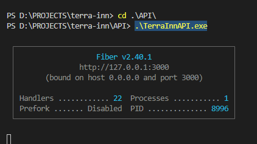

- `###   CONFIG DB  ###`
1. Cấu hình thông số trong .env (Nếu cấu hình tên máy local khác thì mới cần chỉnh)
2. Tuỳ chọn reset data:
	+ DB_CLEARALL=true : Clear all data (Data sẽ reset mỗi khi server chạy lại)
	+ DB_INIT=true: Init lại dữ liệu mẫu (chỉ cần nếu CLEARALL)
3. Tạo DB nếu chưa có (create_db.sql), chú ý đúng tên DB, chỉ cần tạo lần đầu tiên

- `### RUN SERVER ###`
	1. Mở termial mới
	2. cd .\API\
	3. .\TerraInnAPI.exe
* Note: Hoặc mở trực tiếp qua File Explorer cũng đc --> Chạy đc như hình đính kèm là OK

- `### API DOCS ###`
* https://www.postman.com/lively-desert-478950/workspace/terrain-api/collection/16486287-3a6c8cf2-0c86-4a0f-8501-52cecbb82667?ctx=documentation 

- `### API VERSION ###`
	+ 3/12/22: Init source, User
	+ 8/12/22: Motel, MotelGroup, Add pre-build
	+ 10/12/22: Add request, invoice
